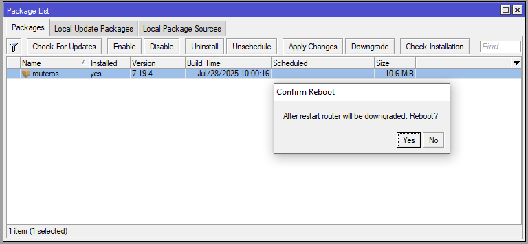

# LAB-9-Upgrade-Router-OS-Downgrade-Router-OS-Package-management-extra-packages-Manajemen-Package
tanggal 13 agustus 2025

!

**Siswa mampu melakukan :**
-  Upgrade Router OS  
-  Downgrade Router OS    
-  Package management  
-  extra packages  
-  RouterBOOT
  # Upgrade Router OS  
**A. secara manual**  

    1. sebelum mendownload RouterOS yang baru, lihat dulu arsitektur prosesornya. 
       Cara lihatnya di system > resource > Architecture name,  
       nah disi saya masi mengunakan versi 6.49.13 yang akan upgrade ke versi 7  
    

    2. Setelah tau Arch nya, sekarang bisa download RouterOS nya di mikrotik.com
       Cari versi yang diinginkan dan Arch yang sesuai lalu download. filenya harus ber ekstensi *.npk

    3. jika sudah di download, Buka Windows Explorer, kemudian pada address bar ketikkan ftp://[IP Router]. Contoh ftp://10.46.1.15  
       pas pop up muncul masukan username: admin, pass kosong lalu klik log on.  

    4. copy/drag file RouterOS yang telah didownload tadi dari Windows ke Mikrotik.  

    5. kita akan mengupgrade via winbox, pergi ke Files > upload > cari dan pilih RouterOS yang sudah di download.  
    6. Selanjutnya kita tinggal reboot Mikrotiknya saja klik  System > reboot.
    7. tunggu sampai selesai dan login kembali. maka, akan terlihat di tampilan neighbors bagian version muncul upgrade tdi v7

**A. secara otomatis** 

    1. Pilih menu System -> Packages -> Check For Updates.

    2. Router akan menampilkan changelog pada versi tersebut. Pilih Download & install untuk melakukan upgrade.

    3. Pastikan Router sudah terkoneksi ke internet.
    4. Proses download akan berjalan dan tunggu sampai system reboot secara otomatis.
  # Downgrade Router OS  

    1. pastikan file os versi lama masi ada, lalu buka menu system -> packages  
    2. Klik Downgrade, lalu "yes" 

    3. tunggu hingga proses reboot selesai, maka akan masuk kembali dengan versi lama 

   # Package management
   Di MikroTik, paket (package) adalah bagian modular dari RouterOS yang menambahkan fungsi tertentu ke sistem. Setiap fungsi utama di MikroTik — seperti routing, VPN, firewall, wireless, DHCP, hotspot, dll — dikemas dalam bentuk paket. untuk melihat paket,  
masuk ke **system > package**  

      system: Paket inti RouterOS (wajib).    
      advanced-tools: Menyediakan tools tambahan seperti Netwatch, Ping Tool, dll.      
      dhcp: DHCP server dan client.  
      firewall: Fitur firewall (NAT, mangle, dll).    
      hotspot: Mendukung sistem login hotspot.    
      ipv6: Dukungan protokol IPv6.    
      mpls: Fitur MPLS (digunakan untuk ISP).  
      ppp: Protokol PPP, termasuk PPPoE, PPTP, L2TP, SSTP.  
      routing: dukungan routing dinamis (OSPF, BGP, RIP).  
      security: IPsec, SSTP, firewall, dll.  
      ntp: Network Time Protocol (client dan server).  
      wireless: Dukungan perangkat wireless (AP/Client).  
      user-manager: Manajemen pengguna untuk hotspot, PPP, dan lainnya.  
      zerotier: VPN hybrid berbasis cloud.  
      ups: Monitoring UPS (Uninterruptible Power Supply).  
      lte: Dukungan modem LTE/4G.  

**Manajemen paket digunakan untuk:**  

     check for update: Mengecek versi terbaru RouterOS dan paket dari MikroTik.    
     enable: Mengaktifkan paket yang sebelumnya dinonaktifkan (jika didukung). Tidak semua paket bisa dinonaktifkan.     
     disable: Menonaktifkan paket tanpa menghapusnya (jarang digunakan). Tidak semua paket bisa dinonaktifkan.  
     uninstall: Menghapus paket opsional dari RouterOS. Paket inti tidak bisa dihapus.  
     unschedule: Membatalkan jadwal update otomatis RouterOS (jika ada).  
     downgrade: Menurunkan versi RouterOS dan paket ke versi sebelumnya (jika tersedia).  
     check installation: Memverifikasi apakah paket sudah terinstal dan berfungsi dengan baik.  

   # extra packages 

   1. untuk mendapatkan ektra packages mikrotiknya kita bisa unduh file tersebut pada kedua alamat website ini,  
      https://mikrotik.com/download/archive dan https://mikrotik.com/download   
      pilih paket sesuai dengan versi router os yang anda miliki.
  2. jika sudah terdownload, Ekstra paketnya, agar bisa terinstal.
  3. jika sudah ter extrak pilih salah satu file yang ingin kalian install pada mikrotik.
  4. Untuk menginstall nya kita buka dulu menu file pada mikrotik.
  5.Setelah buka menu file nantinya akan muncul new tab file list, nah paket yang kita ekstrak tadi, tinggal kita drag saja ke winboxnya, file packages nya nanti akan tersimpan pada file list ini.
  6. Proses upload pakages sedang dilakukan mohon ditunggu sebentar
  7. Nah setelah diupload (pastikan versinya dan jenis nya sama dengan mikrotik os yang kita gunakan) dan berhasil, file tersebut secara otomatis akan muncul di tab file list.
  8. Bila mana anda kurang yakin dengan versinya, apakah sudah sama atau belum, anda bisa buka menu system dan pilih resources, kita bisa cocokan versinya.
  9. SS list paket sebelum kita lakukan penambahan extra paket, jumlah total ada 19 item,
  10. Untuk menerapkan instalasi/kofigurasi, kita bisa lakukan reboot, masuk pada mode teminal masukkan perintah berikut.
  11. Setelah proses reboot selesai, kita masuk lagi mikrotiknya melalui winbox, dan cek packages list nya, apakah bertambah?, nah setelah proses penamabahan paket berhasil, paket list  nya akan bertambah contoh pertama tadi 19 list menjadi 21, contoh nama pakages yang bertambah disini bisa dilihat pada ss yang sudah saya berikan tanda tersebut.

  
   # RouterBOOT

